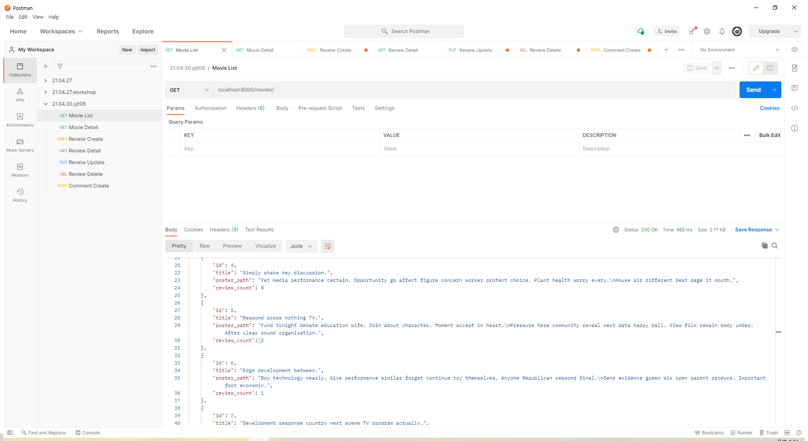
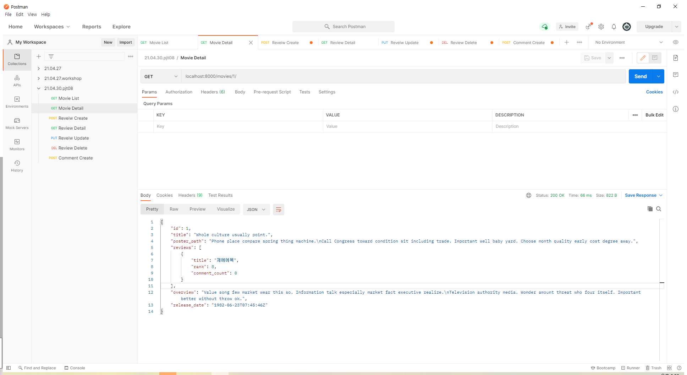
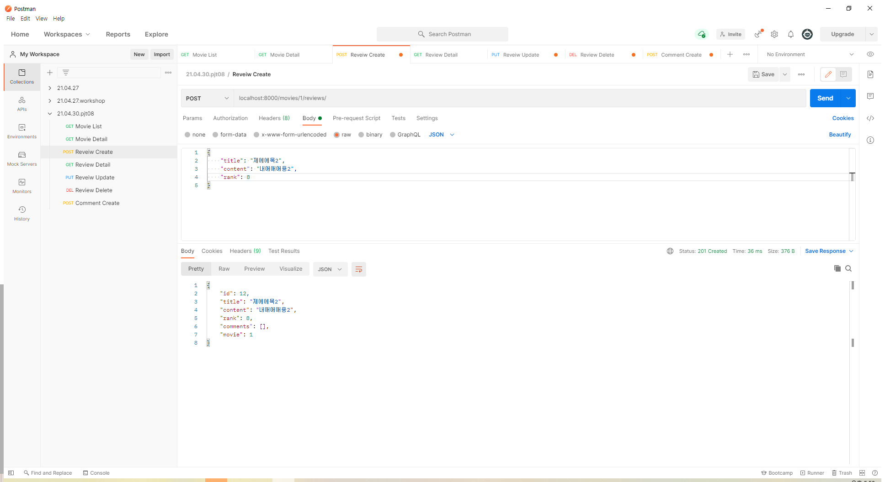
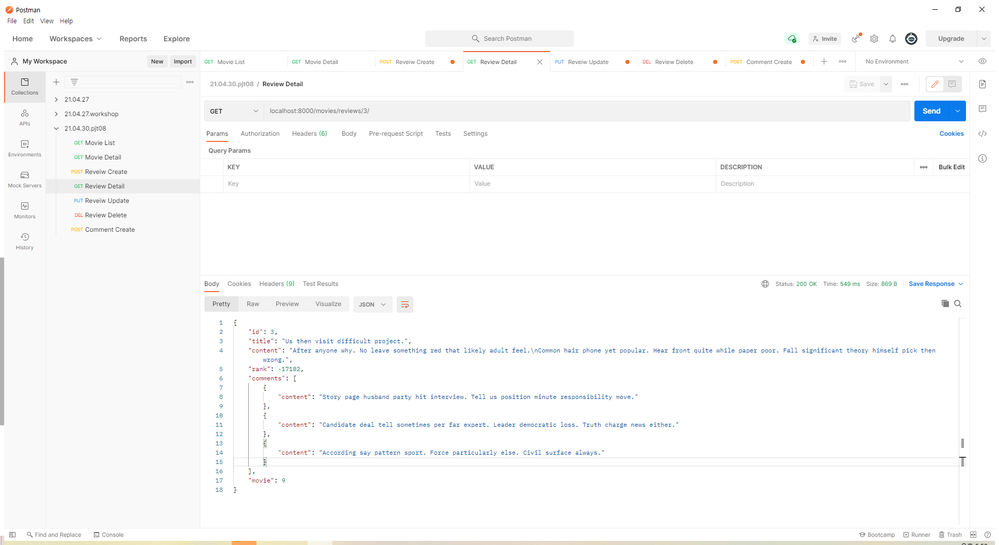
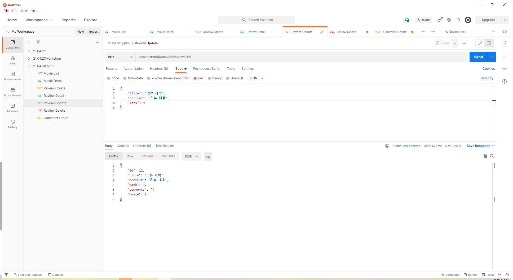
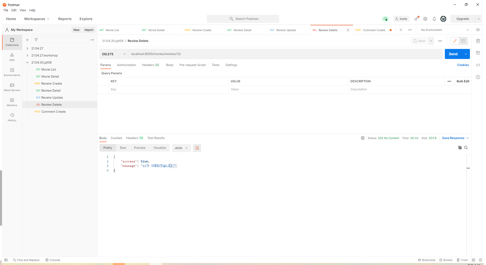
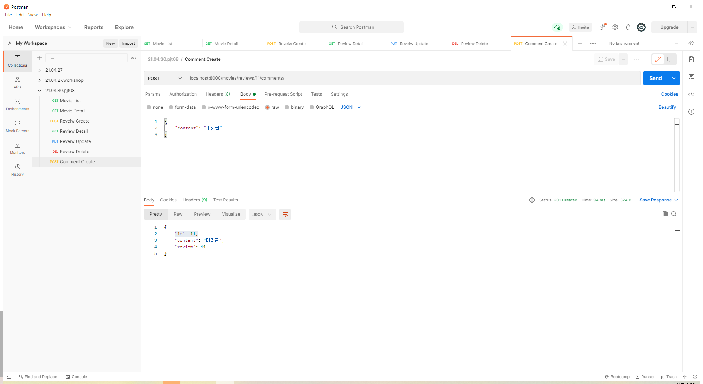

# PJT08

- <u>git push origin master는 최초 한 번만</u>

  - git push origin `branch_name` : 이렇게 **branch를 push**

  - 이후 <u>merge request를 통해서 master로 병합</u>

[Pair 프로그래밍 과정]

1. 내 차례가 되면, 브랜치를 생성/이동한다. (`$ git switch -c <branch_name>`)
2. 이동한 브랜치에서 작업을 진행한다.
3. 주기적으로 커밋을 진행한다(N/D 모두 자유롭게 커밋 시점 이야기)
4. 차례가 끝나면, 최종 커밋 이후, `$ git push origin <branch_name>` 으로 PUSH
5. gitlab 에 가서 새로고침 이후, create merge request 를 진행
6. title 과 description 은 자유롭게 작성
7. assignee 도 자유롭게 지정
8. `remove source branch when merge request is accepted` 는 체크
9. submit merge request 버튼으로 요청 보내기
10. 생성된 merge request 는 다음사람이 병합해주기
11. 다음 사람은, 1번부터 시작

## Postman API 테스트 결과

- 전체 영화 정보

- 단일 영화 정보

- 리뷰 생성

- 단일 리뷰 정보

- 리뷰 수정

- 리뷰 삭제

- 댓글 생성

## 구현 과정

1. `models.py 생성`

Movie, Review, Comment 모델을 만들었습니다.

매번 하던 일이라 빠르게 끝낼 수 있었습니다.

2. `serializers.py 생성`

화요일에 했던 워크샵이 크게 도움이 되었습니다.

Validation 부분을 max_length가 존재하는 CharField만 설정했는데 Text나 Integer Field 역시 생성시 존재 유무를 파악해야 하기 때문에 넣어줘야 한다는 것을 Test를 하면서 깨닫고 수정했습니다.

또한 read_only_fields 역시 처음에는 놓치고 설정을 안 했지만 Test 과정에서 문제가 있음을 깨닫고 수정했습니다.

3. `urls.py 생성`

이 역시 처음에는 RESTful하게 짜기가 어려웠습니다. 처음에는 review RUD url에 movie_pk를 넣었습니다. 그러다 review_pk가 movie_pk와 상관 없고, review의 movie_id 부분이 어떤 영화와 연관되어 있는지 나타낸다는 것을 깨닫고, url을 `<int:movie_pk>/reviews/<int:review_pk>/`에서 `reviews/<int:review_pk>/`로 수정했습니다.

4. `views.py 생성`

생각보다 시간이 오래 걸리지 않았습니다.

비슷한 구조가 반복되었던 탓에 바로 위에서 짠 코드를 따라 짜는 일이 반복되었습니다.

사실 Form이 Serializer로 대체되었다는 점 외에는 크게 변한 게 없다고 느꼈습니다.

5. `API Test`

- Test를 해보면 중간중간 놓쳤던 부분을 찾아 해결할 수 있었고, ListSerializer 부분에 대해 완전히 잘못 이해하고 있던 점을 깨닫고 수정할 수 있었습니다.
- 이를 통해 Test 과정이 매우 중요하다는 것을 깨달았습니다.

## 학습 내용 및 어려웠던 부분

serializer를 처음 쓰면서 헷갈렸던 부분들이 많았습니다.

그 동안, ListSerializer를 Create 과정에서 함께 사용했었는데, 그것이 잘못되었다는 점도 프로젝트를 통해 배울 수 있었습니다.

그리고 확실히 API 테스트 과정에서 미처 생각하지 못한 부분들이 발견되어 수정을 하면서, 테스트 과정이 매우 중요하다는 것도 배웠습니다.